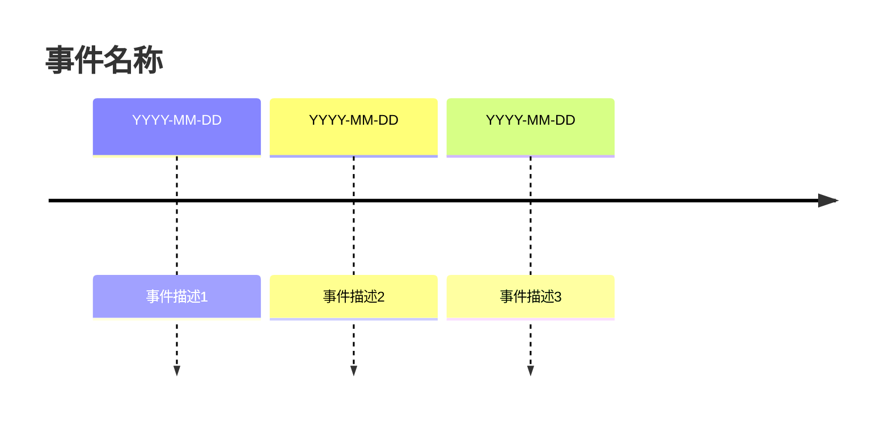
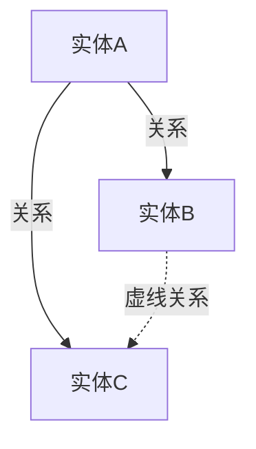
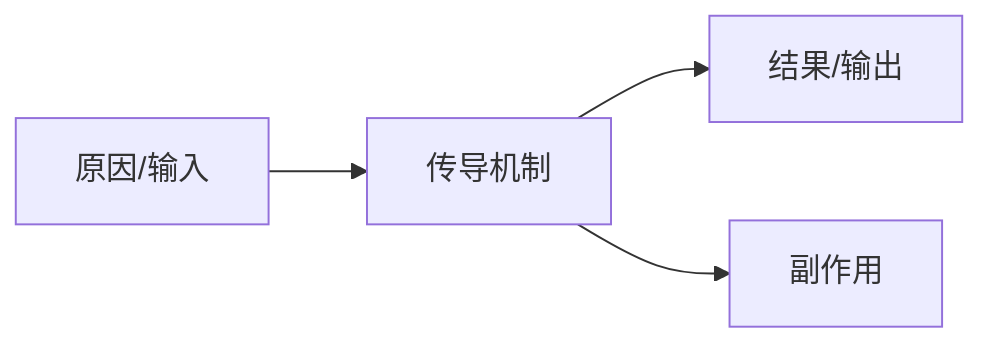
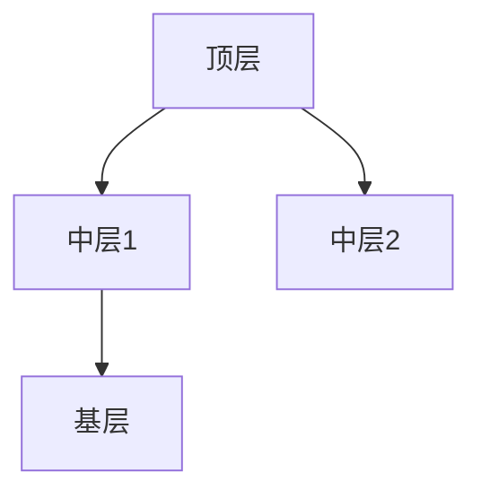

# Mermaid 图表生成规范

在以下场景必须插入 Mermaid 图表（用 ```mermaid 代码块）：

## 1. 时间线：涉及 3+ 个有时间顺序的事件



## 2. 关系图：涉及 3+ 个利益相关方或实体关系



## 3. 流程图：涉及因果链、政策传导、决策路径



## 4. 组织架构：涉及层级结构



## 规则
- 每章至少 1 个 Mermaid 图表或结构化表格
- 图表标题用中文，节点标签简洁（≤15 字）
- 不要在图表中放大段文字
- 如果内容更适合表格呈现，用表格替代图表
